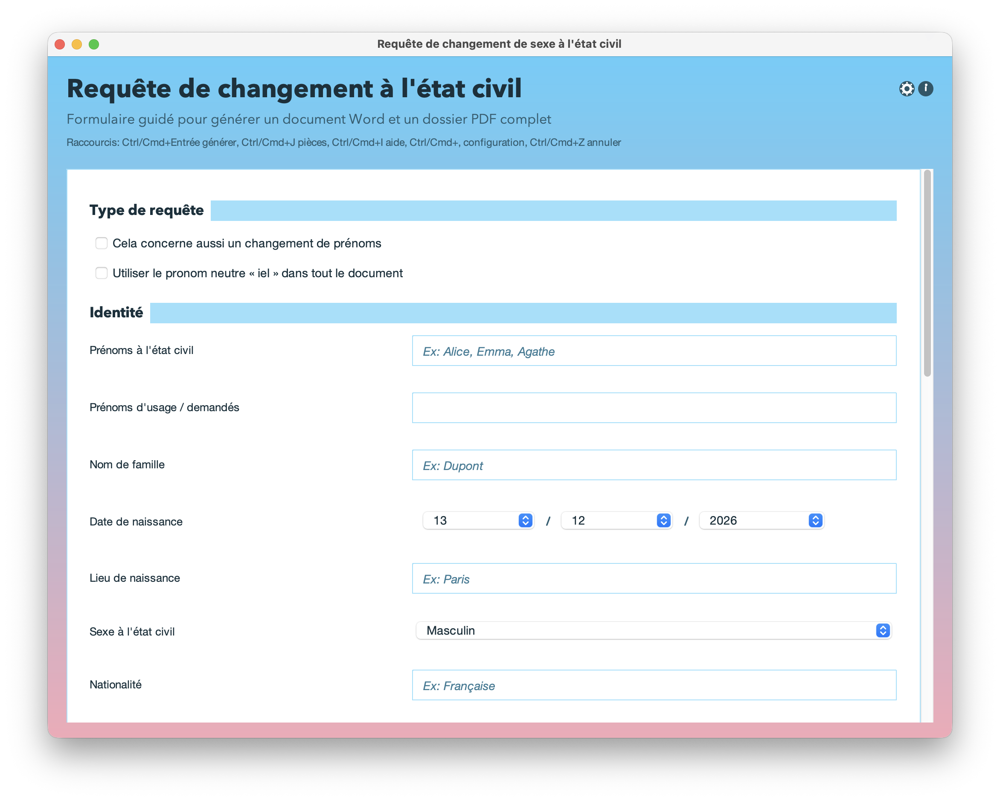

# CECDoc — générateur de requête de changement de mention de sexe à l’état civil 🏳️‍⚧️

<p align="left">
  <a href="release/CECDoc-4.2.0.jar?raw=1">
    
  </a>
  <a href="release/CECDoc-4.2.0.exe.7z?raw=1">
    
  </a>
  <a href="release/CECDoc-3.0.0.dmg?raw=1">
    
  </a>
  <a href="https://www.swisstransfer.com/d/d254f0a8-80a7-4745-80bf-9e3f2643d24c">
    
  </a>
</p>

<p align="center">
  
</p>
<h3 align="center"><em>Le changement d'état civil c'est maintenant !</em></h3>

**CECDoc** est une **application communautaire** pour les personnes trans.

C’est une application libre et open-source **desktop** (Java/Swing), développée en **projet Maven**, qui aide à préparer une **requête de changement de la mention de sexe à l’état civil** — **avec ou sans changement de prénoms** — puis génère un **document Word (.docx)** ou **LibreOffice (.odt)** prêt à relire, compléter (signature, pièces) et déposer, ainsi qu'un PDF du dossier complet avec annexes, prêt à imprimer, avec les pièces que vous aurez jointes. Il est également possible de générer la lettre pour le/la Greffier·e en Chef du Tribunal à mettre en entête du dossier, ainsi que :
- une lettre pour faire respecter les prénoms d’usage à l’université d'après la circulaire de la Ministre de l'enseignement supérieur en date du 17 avril 2019 ;
- une lettre pour faire mettre à jour ses informations auprès d’une administration après un changement de prénoms et/ou de sexe à l'état civil.

<p align="center">
  
</p>

## ❓ Pourquoi ?

Les démarches d’état civil peuvent être longues, coûteuses, et parfois vécues comme une **violence administrative** (paperasse, injonctions, barrières juridiques, phobie administrative ou simplement difficultés à se mobiliser en raison de sa santé mentale, etc.).  
CECDoc vise un objectif simple : **réduire la charge** et **reprendre du pouvoir** sur sa procédure en automatisant la génération et la mise en forme d’une requête cohérente, tout en laissant la place au récit personnel et aux choix de pièces.

L’outil n’est pas un substitut à un accompagnement juridique ou associatif : il facilite la production d’un document, pas la stratégie ni la "défense".

## 🕹️ Fonctionnalités

- Formulaire guidé en interface Swing.
- Dossier de changement de mention de sexe à l’état civil.
- Option de changement de prénoms corrélé.
- Option pronom neutre.
- Génération de plusieurs sorties à chaque export :
  - un document Word `.docx` ou LibreOffice `.odt` de la requête ;
  - un PDF du dossier complet prêt au dépôt ;
  - éventuellement, document Word `.docx` ou LibreOffice `.odt` destiné au/à la Greffier·e en Chef du Tribunal ;
  - dans le menu "Autre documents" :
    - une lettre `.docx` ou `.odt`  pour faire respecter les prénoms d’usage à l’université ;
    - une lettre `.docx` ou `.odt` pour faire mettre à jour ses informations auprès d’une administration après un changement de prénoms et/ou de sexe à l'état civil.
- Fenêtre "Autres documents" : générer les deux lettres susmentionnées.
- Fenêtre "Pièces justificatives" :
  - personnalisation des intitulés ;
  - ajout de fichiers par intitulé ;
  - suppression d’un fichier joint ;
  - réordonnancement des fichiers joints ;
  - signalement des fichiers introuvables avec correction possible.

## 🗂️ PDF final

Le PDF final est assemblé dans cet ordre :

1. requête Word convertie en PDF ;
2. puis, pour chaque intitulé de pièce justificative dans l’ordre d’affichage UI, les fichiers attachés dans l’ordre défini dans l’interface.

Formats de pièces jointes acceptés : **DOC, ODT, DOCX, PDF, JPG, JPEG, PNG**.

## 📑 Conversion et fusion PDF

- Conversion `.docx -> .pdf` : conversion directe via **docx4j**.
- Conversion `.doc -> .pdf` : conversion via **LibreOffice/JODConverter** (secours pour les anciens formats Word).
- Conversion `.odt -> .pdf`: conversion via **LibreOffice/JODConverter**
- Conversion image (`jpg/jpeg/png`) vers PDF : via **PDFBox**.
- Fusion des PDF : via **PDFBox**.
- Écritures atomiques pour limiter les fichiers partiels en cas d’échec.

## 🏳️‍🌈 Thèmes visuels

Le panneau **Configuration** permet de choisir un thème :

- Par défaut
- Drapeau trans
- Drapeau non-binaire
- Drapeau lesbien
- Drapeau intersexe
- Drapeau arc-en-ciel

Quand un thème explicite est choisi en configuration, il prend le dessus sur le comportement automatique.

## ⚙️ Persistance locale (`cecdoc.conf`)

CECDoc sauvegarde l’état des formulaires dans un fichier `.cecdoc.conf` (format `.properties`) placé à côté de l’exécutable, avec repli sur le répertoire courant.

Le fichier inclut notamment :

- données saisies dans les formulaires ;
- option "effacer après export" ;
- intitulés de pièces justificatives ;
- fichiers joints (URI, nom d’affichage, type, ordre).

Comportement :

- chargement automatique au démarrage si le fichier existe ;
- mise à jour au fil de la saisie ;
- suppression lors d’un effacement global.

## ⌨️ Raccourcis clavier

- `Ctrl/Cmd + Entrée` : générer le dossier
- `Ctrl/Cmd + J` : ouvrir "Pièces justificatives"
- `Ctrl/Cmd + I` ou `F1` : ouvrir l’aide
- `Ctrl/Cmd + Shift + L` : activer/désactiver le mode "changement de prénoms"
- `Échap` : effacer les erreurs de validation affichées

## 📄 Exemples

Des exemples de documents générés sont disponibles :
- [Ici](exemples/requete_changement_sexe.docx?raw=1) pour la requête au format Word ;
- [Ici](exemples/requete_changement_sexe_dossier_complet.pdf?raw=1) pour le PDF du dossier complet ;
- [Ici](exemples/requete_changement_sexe_lettre_greffierE.docx?raw=1) pour la lettre au/à la greffier·e ;
- [Ici](exemples/lettre_prenom_usage_universite.docx?raw=1) pour la lettre à l'université ;
- [Ici](exemples/lettre_mise_a_jour_administration.docx?raw=1) pour la lettre aux administrations.

## 🛠️ Installation/utilisation

### Build Windows (.exe)

Une version **Windows** est disponible au format [7-Zip](https://www.7-zip.fr/). Un bouton pour la télécharger est disponible plus haut. Téléchargez le fichier, exécutez-le et suivez les instructions d'installation.

### Build macOS (.dmg)

Deux versions **macOS** sont également disponibles : le .dmg est trop lourd pour être uploadé sur GitHub. Pour la version 3.0.0, j'ai réussi à la faire passer en la compressant au format [7-Zip](https://www.7-zip.fr/). Elle est donc téléchargeable directement sur le repo via le bouton "Télécharger 3.0.0" disponible plus haut. La dernière version (4.2.0) est distribuée via un site de partage de fichiers (bouton "Télécharger dernière version"), mais ces liens expirent et il se peut que j'oublie de le mettre à jour tous les 30 jours. Dans ce cas, n'hésitez pas à [m'envoyer un mail](mailto:rdr@tutanota.de) pour solliciter cette dernière version, qui présente des améliorations majeures.

#### Si macOS (Gatekeeper) bloque CECDoc :

Selon la configuration de **macOS**, au premier lancement, un message du type *« app provenant d’un développeur non identifié / ne peut pas être ouverte »* peut s’afficher.

**Méthode la plus simple (recommandée) :**
1. Essayer d’ouvrir **CECDoc** une première fois (même si macOS le bloque).
2. Aller dans **Réglages Système -> Confidentialité et sécurité**.
3. Dans la section *Sécurité*, cliquer sur **Ouvrir quand même**, puis confirmer **Ouvrir**.

Alternative rapide : **clic droit (ou Ctrl-clic) sur l’app → Ouvrir → Ouvrir**.

**Méthode Terminal (retirer l’attribut de quarantaine) :**

```bash
sudo xattr -r -d com.apple.quarantine "/Applications/CECDoc.app"
```

### macOS / Windows / Linux (JAR)

Une fois que vous avez un `.jar` exécutable, et après avoir installé Java (voir plus bas), double cliquez dessus ou faites :

```bash
java -jar CECDoc-4.2.0.jar
```

## 💻 Prérequis

- Java 17 (JRE/JDK)
- Maven (pour compiler)

## ⬇️ Installer Java (nécessaire si vous utilisez la version .jar, optionnel pour les .dmg et .exe)

CECDoc requiert **Java 17 minimum**, mais fonctionne aussi avec des versions plus récentes. Au moment où j'écris ces lignes, la dernière version LTS est **Java 25**.

### Téléchargement GUI (le plus facile) :
https://www.oracle.com/java/technologies/downloads/ 

### macOS (avec Homebrew)

```bash
brew update
brew install openjdk
# (optionnel, recommandé) rendre le JDK visible pour les wrappers Java macOS
sudo ln -sfn "$HOMEBREW_PREFIX/opt/openjdk/libexec/openjdk.jdk" /Library/Java/JavaVirtualMachines/openjdk.jdk
```

### Windows

- Oracle JDK 25 :
```powershell
winget install -e --id Oracle.JDK.25
```

- Microsoft Build of OpenJDK 25 (alternative) :
```powershell
winget search Microsoft.OpenJDK
winget install Microsoft.OpenJDK.25
```

### Linux

#### Debian / Ubuntu / dérivés (apt)

**Option A — dépôts de la distribution (si disponible)**
```bash
sudo apt update
sudo apt install -y openjdk-25-jdk
```

**Option B — dépôt Adoptium (Temurin) (si votre distro ne propose pas encore OpenJDK 25)**
```bash
sudo apt install -y wget apt-transport-https gpg
wget -qO - https://packages.adoptium.net/artifactory/api/gpg/key/public | gpg --dearmor | sudo tee /etc/apt/trusted.gpg.d/adoptium.gpg > /dev/null
echo "deb https://packages.adoptium.net/artifactory/deb $(awk -F= '/^VERSION_CODENAME/{print$2}' /etc/os-release) main" | sudo tee /etc/apt/sources.list.d/adoptium.list > /dev/null
sudo apt update
sudo apt install -y temurin-25-jdk
```

#### Fedora / RHEL / Rocky / Alma (dnf)

```bash
sudo dnf install -y java-latest-openjdk
```

#### openSUSE / SLES (zypper)

**Dépôt Adoptium (Temurin)**
```bash
sudo zypper ar -f https://packages.adoptium.net/artifactory/rpm/opensuse/$(. /etc/os-release; echo $VERSION_ID)/$(uname -m) adoptium
sudo zypper refresh
sudo zypper install -y temurin-25-jdk
```

#### Arch Linux / Manjaro (pacman)

**Dépôts officiels (OpenJDK "courant")**
```bash
sudo pacman -Syu --noconfirm jdk-openjdk
```

## 👷 Compilation depuis les sources (Maven)

```bash
mvn clean package
```

Le binaire est généré dans `target/` (le nom exact dépend du packaging).

## 🌐 Accessibilité

CECDoc est conçu pour rester utilisable au clavier et avec des technologies d’assistance.

- Navigation clavier complète sur les formulaires principaux et secondaires.
- Raccourcis globaux (génération, aide, pièces justificatives, configuration, etc.).
- Noms et descriptions accessibles (`AccessibleContext`) sur les composants interactifs clés.
- Association explicite des labels aux champs (`labelFor`) pour améliorer la lecture par lecteur d’écran.
- Boutons par défaut dans les boîtes de dialogue (validation rapide à `Entrée`).
- Fermeture/annulation cohérente via `Échap` dans les dialogues.
- États d’erreur affichés sans blocage de l’interface (validation en ligne).
- Ordre de focus maîtrisé sur l’écran principal pour un parcours cohérent sans souris.

## 🥚 Easter eggs

- Journée internationale contre l'homophobie, la transphobie, et la biphobie : le 17 mai, à l'ouverture du programme, un pop-up s'affiche... 🏳️‍🌈
- Journée internationale de la visibilité pansexuelle : le 24 mai, à l'ouverture du programme, un pop-up s'affiche pour la journée internationale de la visibilité pansexuelle. Et quel popup... 😳
- Journée internationale de visibilité des personnes non-binaires : le 14 juillet, un pop-up s'affiche si le thème actif est non-binaire. Just a bit shady... 🕶️
- Journée internationale de visibilité lesbienne : le 26 avril, à l'ouverture du programme, un pop-up s'affiche si le thème lesbien est actif... histoire de les congratuler comme il se doit. 😍
- Journée de la bisexualité : le 23 septembre, à l'ouverture du programme, un pop-up s'affiche... Just a bit shadier... 👓
- Coming out day : le 11 octobre, à l'ouverture du programme, un pop-up s'affiche. 👯
- Journée internationale de visibilité intersexe : le 8 novembre, un pop-up s'affiche si le thème intersexe est actif. 💛💜💛
- TDoV – Trans Day of Visibility : le 31 mars, à l'ouverture du programme, un pop-up s'affiche. 🏳️‍⚧️

## ✉️ Me contacter

Vous pouvez me contacter via [ce mail](mailto:rdr@tutanota.de).

---